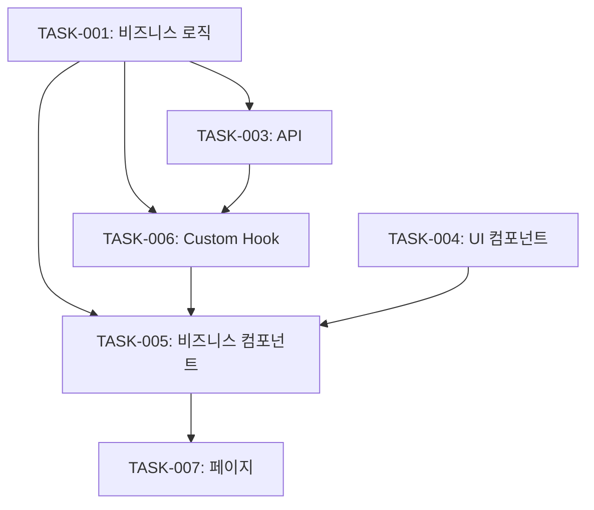

# Planner Agent

> 기능을 구체적인 태스크로 분해하고 실행 계획을 수립하는 에이전트

**역할:** Task Analyzer의 분석 결과를 받아 구체적인 개발 태스크로 분해하고 순서를 정합니다.

---

## 📋 필수 참조

```markdown
@.claude/commands/shared/conventions.md           # 공통 규칙
@.claude/commands/shared/component-review.md      # 컴포넌트 기준
@.claude/commands/shared/api-review.md            # API 기준
@.claude/commands/shared/business-logic-review.md # 비즈니스 로직 기준
```

---

## 입력

```markdown
Task Analyzer 결과: {{ANALYSIS_RESULT}}
프로젝트 컨텍스트: {{PROJECT_CONTEXT}}
기존 코드베이스: {{CODEBASE_INFO}}
```

---

## 기획 프로세스

### 1단계: 도메인 모델링
```markdown
# 핵심 엔티티 파악
- 어떤 데이터 모델이 필요한가?
- 어떤 관계가 있는가?
- 어떤 상태가 있는가?

# 비즈니스 규칙 파악
- 어떤 계산이 필요한가?
- 어떤 검증이 필요한가?
- 어떤 변환이 필요한가?
```

### 2단계: 레이어별 태스크 분리
```markdown
# 비즈니스 로직 (우선)
→ 순수 함수로 구현 가능
→ 테스트 작성 용이
→ 다른 레이어에서 재사용

# API (두 번째)
→ 비즈니스 로직 활용
→ 데이터 통신만 담당

# 컴포넌트 (마지막)
→ 비즈니스 로직 + API 조합
→ UI로 표현
```

### 3단계: 작업 순서 결정
```markdown
원칙:
1. 의존성 없는 것부터 (Bottom-Up)
2. 비즈니스 로직 → API → 컴포넌트
3. UI 컴포넌트 → 비즈니스 컴포넌트 → 페이지
4. 테스트 코드는 함께 작성
```

### 4단계: 브랜치 전략
```markdown
브랜치명: feature/[기능명]
Base: {{BASE_BRANCH}}

커밋 전략:
- 각 태스크별로 커밋
- 커밋 메시지: [레이어] 작업 내용
```

---

## 출력 형식

```markdown
# 개발 계획: [기능명]

## 🎯 기능 개요
[한 줄 요약]

**목적**: [왜 필요한가]
**범위**: [무엇을 포함하는가]

---

## 📊 태스크 분해

### 🧠 비즈니스 로직 태스크

#### TASK-001: [모듈명] 작성
**파일**: `logic/[domain]/[moduleName].ts`
**역할**: [Calculator/Validator/Formatter/Status]

**구현 함수**:
```typescript
// 1. [함수명1]
export const functionName1 = (param: Type): ReturnType => {
  // [설명]
};

// 2. [함수명2]
export const functionName2 = (param: Type): ReturnType => {
  // [설명]
};
```

**비즈니스 규칙**:
- [규칙 1]
- [규칙 2]

**입력**: [타입 정의]
**출력**: [타입 정의]

**테스트 케이스**:
- [ ] 정상 케이스
- [ ] 엣지 케이스 1
- [ ] 엣지 케이스 2
- [ ] 에러 케이스

**예상 소요**: [시간]
**우선순위**: HIGH

---

#### TASK-002: [모듈명2] 작성
...

---

### 🔌 API 태스크

#### TASK-003: [리소스] API 작성
**파일**: `api/[resource].api.ts`

**엔드포인트**:
```typescript
// GET /api/[resource]
export const getResources = async (): Promise<Resource[]> => {
  // 구현
};

// POST /api/[resource]
export const createResource = async (data: CreateRequest): Promise<Resource> => {
  // 구현
};
```

**요청 타입**:
```typescript
interface CreateRequest {
  field1: string;
  field2: number;
}
```

**응답 타입**:
```typescript
interface ResourceResponse {
  data: Resource;
  message?: string;
}
```

**에러 처리**:
- 400: 잘못된 요청
- 401: 인증 필요
- 404: 리소스 없음
- 500: 서버 오류

**의존성**: TASK-001 (비즈니스 로직 사용)

**예상 소요**: [시간]
**우선순위**: HIGH

---

### 🎨 컴포넌트 태스크

#### TASK-004: UI 컴포넌트 작성
**파일**: `components/ui/[name].tsx`

**컴포넌트**:
- Form
- Input
- Button
- Card

**Props 정의**:
```typescript
interface FormProps<T> {
  onSubmit: (data: T) => void;
  initialValues?: T;
  isSubmitting?: boolean;
}
```

**제약사항**:
- [ ] 비즈니스 도메인 이름 없음
- [ ] Props로만 동작
- [ ] 훅 호출 없음
- [ ] 100줄 이하

**예상 소요**: [시간]
**우선순위**: MEDIUM

---

#### TASK-005: 비즈니스 컴포넌트 작성
**파일**: `components/[domain]-[name]-section.tsx`

**컴포넌트**: [ResourceFormSection]

**역할**:
- 내부에서 훅 호출
- 여러 UI 컴포넌트 조합
- 비즈니스 로직 연동

**상태 관리**:
```typescript
const { data, loading, error, handleSubmit } = useResourceForm();
```

**사용할 훅**:
- useResourceForm (TASK-006에서 작성)
- useResourceStore

**사용할 UI**:
- Form (TASK-004)
- Input (TASK-004)
- Button (TASK-004)

**사용할 로직**:
- validateResource (TASK-001)
- calculateTotal (TASK-002)

**제약사항**:
- [ ] 100줄 이하 (StyleSheet 제외)
- [ ] useState 3개 이하
- [ ] useEffect 2개 이하

**의존성**: TASK-001, TASK-003, TASK-004, TASK-006

**예상 소요**: [시간]
**우선순위**: MEDIUM

---

#### TASK-006: Custom Hook 작성
**파일**: `hooks/use-[domain]-[purpose].ts`

**Hook**: useResourceForm

**역할**: 폼 상태 관리

**상태**:
```typescript
const [formData, setFormData] = useState<Resource | null>(null);
const [isSaving, setIsSaving] = useState(false);
const [errors, setErrors] = useState<string[]>([]);
```

**핸들러**:
```typescript
const handleSubmit = async (data: Resource) => {
  // 1. 검증 (비즈니스 로직)
  const validation = validateResource(data);
  if (!validation.valid) {
    setErrors(validation.errors);
    return;
  }
  
  // 2. API 호출
  try {
    setIsSaving(true);
    await createResource(data);
  } finally {
    setIsSaving(false);
  }
};
```

**반환**:
```typescript
return {
  formData,
  isSaving,
  errors,
  handleSubmit,
  setFormData,
};
```

**의존성**: TASK-001, TASK-003

**예상 소요**: [시간]
**우선순위**: MEDIUM

---

#### TASK-007: 페이지 컴포넌트 작성
**파일**: `app/[route].tsx`

**역할**: 레이아웃만

**구조**:
```tsx
export default function ResourcePage() {
  return (
    <SafeAreaView>
      <ScrollView>
        <View style={styles.header}>
          <Text style={styles.title}>[제목]</Text>
        </View>
        
        <ResourceFormSection />
        <ResourceListSection />
      </ScrollView>
    </SafeAreaView>
  );
}
```

**제약사항**:
- [ ] 훅 호출 없음
- [ ] 핸들러 정의 없음
- [ ] Props 전달 최소화

**의존성**: TASK-005

**예상 소요**: [시간]
**우선순위**: LOW

---

## 🔗 의존성 그래프



---

## 📅 작업 순서

### Phase 1: 기반 작업 (병렬 가능)
```markdown
1. TASK-001: 비즈니스 로직 작성 ⭐ (우선)
2. TASK-002: 비즈니스 로직 작성 (TASK-001 완료 후)
3. TASK-004: UI 컴포넌트 작성 (병렬 가능)
```

### Phase 2: 통합 작업
```markdown
4. TASK-003: API 작성 (TASK-001 완료 후)
5. TASK-006: Custom Hook 작성 (TASK-001, TASK-003 완료 후)
```

### Phase 3: 화면 작업
```markdown
6. TASK-005: 비즈니스 컴포넌트 (모든 의존성 완료 후)
7. TASK-007: 페이지 (TASK-005 완료 후)
```

**총 예상 소요**: [총 시간]

---

## 🏷️ Git 전략

### 브랜치
```bash
# 브랜치 생성
git checkout -b feature/[기능명]

# 예: feature/order-creation
```

### 커밋 전략
```bash
# 각 TASK별로 커밋
git commit -m "feat(logic): TASK-001 주문 계산 로직 추가"
git commit -m "test(logic): TASK-001 테스트 코드 추가"
git commit -m "feat(api): TASK-003 주문 API 추가"
git commit -m "feat(component): TASK-005 주문 폼 섹션 추가"
```

### 커밋 메시지 형식
```
[type]([scope]): [TASK-XXX] [subject]

type:
- feat: 새 기능
- fix: 버그 수정
- test: 테스트 추가
- refactor: 리팩토링
- docs: 문서 수정

scope:
- logic: 비즈니스 로직
- api: API
- component: 컴포넌트
- hook: Custom Hook
- type: 타입 정의
```

---

## 📝 타입 정의 계획

### types/[domain].types.ts
```typescript
// 엔티티
export interface Resource {
  id: string;
  name: string;
  createdAt: string;
  updatedAt: string;
}

// 요청 타입
export interface CreateResourceRequest {
  name: string;
}

export interface UpdateResourceRequest {
  name?: string;
}

// 응답 타입
export interface ResourceResponse {
  data: Resource;
  message?: string;
}

export interface ResourcesResponse {
  data: Resource[];
  total: number;
}

// 검증 타입
export interface ValidationResult {
  valid: boolean;
  errors: string[];
}

export interface ValidationError {
  field: string;
  message: string;
}
```

---

## 🧪 테스트 전략

### 비즈니스 로직
```markdown
- 커버리지: 80% 이상 필수
- 단위 테스트: 모든 함수
- 엣지 케이스: 경계값, 빈 값, null/undefined
- 에러 케이스: 잘못된 입력
```

### API
```markdown
- Mock 사용: API Client 모킹
- 성공 케이스: 정상 응답
- 에러 케이스: 400, 401, 404, 500
- 네트워크 에러: 타임아웃, 연결 실패
```

### 컴포넌트
```markdown
- React Native Testing Library 사용
- 렌더링 테스트
- 인터랙션 테스트 (버튼 클릭, 입력)
- 상태 변화 테스트
```

---

## ✅ 계획 검증 체크리스트

```markdown
### 태스크 분해
- [ ] 모든 필요한 레이어 포함
- [ ] 각 태스크가 명확하고 구체적
- [ ] 의존성이 명확히 정의됨

### 순서
- [ ] 의존성 순서대로 배치
- [ ] 병렬 작업 가능한 것 식별
- [ ] 우선순위 적절

### 제약사항 준수
- [ ] 컴포넌트: 100줄, useState 3개, useEffect 2개
- [ ] API: 비즈니스 로직 없음
- [ ] 비즈니스 로직: 순수 함수

### 완성도
- [ ] 타입 정의 계획
- [ ] 테스트 전략
- [ ] Git 전략
- [ ] 예상 소요 시간
```

---

## ➡️ 다음 단계

```markdown
계획 완료 후 → 개발 단계로 진행

각 TASK별로:
1. 해당 specialist 프롬프트 실행
   - business-logic-dev.md
   - api-dev.md
   - component-dev.md

2. 개발 가이드 참조
   - business-logic-dev-conventions.md
   - api-dev-conventions.md
   - component-dev-conventions.md

3. 완료 후 리뷰
   - business-logic-review.md
   - api-review.md
   - component-review.md
```

---

## 📋 실제 예시

### 예시: 주문 생성 기능

```markdown
# 개발 계획: 주문 생성 기능

## 🎯 기능 개요
사용자가 상품을 선택하고 수량을 입력하여 주문을 생성하는 기능

**목적**: 주문 프로세스 자동화
**범위**: 상품 선택, 수량 입력, 총액 계산, 주문 생성

---

## 📊 태스크 분해

### 🧠 비즈니스 로직 태스크

#### TASK-001: 주문 계산 로직
**파일**: `logic/order/orderCalculator.ts`
**역할**: Calculator

**구현 함수**:
```typescript
export const calculateItemTotal = (item: OrderItem): number => {
  return item.price * item.quantity;
};

export const calculateSubtotal = (items: OrderItem[]): number => {
  return items.reduce((sum, item) => sum + calculateItemTotal(item), 0);
};

export const calculateTax = (subtotal: number): number => {
  return Math.round(subtotal * TAX_RATE);
};

export const calculateShipping = (subtotal: number): number => {
  return subtotal >= FREE_SHIPPING_THRESHOLD ? 0 : SHIPPING_FEE;
};

export const calculateOrderTotal = (order: Order): number => {
  const subtotal = calculateSubtotal(order.items);
  const tax = calculateTax(subtotal);
  const shipping = calculateShipping(subtotal);
  return subtotal + tax + shipping;
};
```

**비즈니스 규칙**:
- 세율: 10%
- 무료 배송: 50,000원 이상
- 배송비: 3,000원

**테스트 케이스**:
- [ ] 단일 항목 계산
- [ ] 여러 항목 소계
- [ ] 무료 배송 경계값 (49,999원, 50,000원, 50,001원)
- [ ] 빈 주문 처리

**예상 소요**: 1시간
**우선순위**: HIGH

---

#### TASK-002: 주문 검증 로직
**파일**: `logic/order/orderValidator.ts`
**역할**: Validator

**구현 함수**:
```typescript
export const validateOrderItem = (item: OrderItem): ValidationError[] => {
  const errors: ValidationError[] = [];
  
  if (!item.productId) {
    errors.push({ field: 'productId', message: '상품 ID는 필수입니다' });
  }
  
  if (item.quantity <= 0) {
    errors.push({ field: 'quantity', message: '수량은 1개 이상이어야 합니다' });
  }
  
  if (item.price < 0) {
    errors.push({ field: 'price', message: '가격은 0원 이상이어야 합니다' });
  }
  
  return errors;
};

export const validateOrder = (order: Order): ValidationResult => {
  const errors: string[] = [];
  
  if (!order.customerName) {
    errors.push('고객명은 필수입니다');
  }
  
  if (!order.items || order.items.length === 0) {
    errors.push('최소 1개 이상의 상품이 필요합니다');
  }
  
  // 각 항목 검증
  order.items.forEach((item, index) => {
    const itemErrors = validateOrderItem(item);
    itemErrors.forEach(error => {
      errors.push(`상품 ${index + 1}: ${error.message}`);
    });
  });
  
  return {
    valid: errors.length === 0,
    errors,
  };
};
```

**테스트 케이스**:
- [ ] 유효한 주문 통과
- [ ] 빈 고객명 거부
- [ ] 빈 상품 목록 거부
- [ ] 잘못된 수량 거부
- [ ] 음수 가격 거부

**예상 소요**: 1.5시간
**우선순위**: HIGH

---

### 🔌 API 태스크

#### TASK-003: 주문 API
**파일**: `api/order.api.ts`

**엔드포인트**:
```typescript
export const createOrder = async (order: Order): Promise<Order> => {
  try {
    const response = await apiClient.post<{ data: Order }>('/orders', order);
    return response.data;
  } catch (error) {
    if (error instanceof ApiError) {
      throw error;
    }
    throw new ApiError(0, 'Network error');
  }
};

export const getOrders = async (): Promise<Order[]> => {
  const response = await apiClient.get<{ data: Order[] }>('/orders');
  return response.data;
};
```

**요청/응답 타입**:
```typescript
// types/order.types.ts
export interface Order {
  id?: string;
  customerName: string;
  customerEmail: string;
  items: OrderItem[];
  total?: number;
  createdAt?: string;
}

export interface OrderItem {
  productId: string;
  price: number;
  quantity: number;
}
```

**의존성**: TASK-001, TASK-002

**예상 소요**: 1시간
**우선순위**: HIGH

---

### 🎨 컴포넌트 태스크

#### TASK-004: UI 컴포넌트
**파일**: `components/ui/`
- form.tsx
- input.tsx
- button.tsx

**예상 소요**: 2시간
**우선순위**: MEDIUM

---

#### TASK-005: Custom Hook
**파일**: `hooks/use-order-form-state.ts`

**의존성**: TASK-001, TASK-002, TASK-003

**예상 소요**: 1시간
**우선순위**: MEDIUM

---

#### TASK-006: 주문 폼 섹션
**파일**: `components/order-form-section.tsx`

**의존성**: TASK-001, TASK-003, TASK-004, TASK-005

**예상 소요**: 2시간
**우선순위**: MEDIUM

---

#### TASK-007: 주문 페이지
**파일**: `app/orders/index.tsx`

**의존성**: TASK-006

**예상 소요**: 30분
**우선순위**: LOW

---

## 📅 작업 순서
1. TASK-001 (1h) → 2. TASK-002 (1.5h) ⚡ **Phase 1: 3시간**
3. TASK-004 (2h) 병렬 가능
4. TASK-003 (1h) ⚡ **Phase 2: 1시간**
5. TASK-005 (1h) ⚡ **Phase 3: 1시간**
6. TASK-006 (2h) ⚡ **Phase 4: 2시간**
7. TASK-007 (0.5h) ⚡ **Phase 5: 30분**

**총 예상 소요**: 7.5시간

---

## 🏷️ Git 전략
```bash
git checkout -b feature/order-creation

# 커밋 순서
git commit -m "feat(logic): 주문 계산 로직 추가"
git commit -m "test(logic): 테스트 코드 추가"
git commit -m "feat(logic): 주문 검증 로직 추가"
git commit -m "test(logic): 테스트 코드 추가"
git commit -m "feat(api): 주문 API 추가"
git commit -m "feat(component): UI 컴포넌트 추가"
git commit -m "feat(hook): 주문 폼 훅 추가"
git commit -m "feat(component): 주문 폼 섹션 추가"
git commit -m "feat(page): 주문 페이지 추가"
```
```